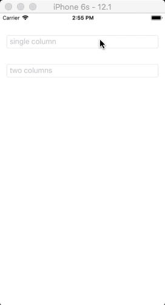

## MultiPickerView

Multi-column linkage pickerView based on c# (xamarin.forms)

The project only realized the iOS pickerview linkage effect

## Effect


## Usage

This linkage effect refers to ios implementation, there are only three methods, they are **Groupmodel.cs、  Pickerview.cs、Pickerviewrenderer. cs**, which are very simple to use.

It contains all the properties of the native pickerView control.

```
<?xml version="1.0" encoding="utf-8"?>
<ContentPage xmlns="http://xamarin.com/schemas/2014/forms" 
             xmlns:x="http://schemas.microsoft.com/winfx/2009/xaml"
             xmlns:local="clr-namespace:MultiPickerView" 
             xmlns:pickerView="clr-namespace:MultiPickerView.extend;assembly=MultiPickerView"
             x:Class="MultiPickerView.MainPage">
    <StackLayout>
        <pickerView:PickerView
            Margin="15"
            Title="two columns"
            HorizontalOptions="FillAndExpand" 
            SelectedSource="{Binding TwoSource}">
        </pickerView:PickerView>
    </StackLayout>
</ContentPage>
```
